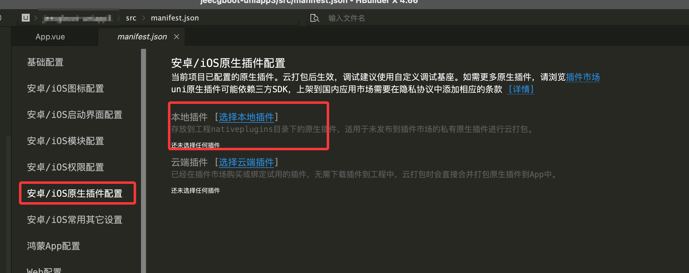
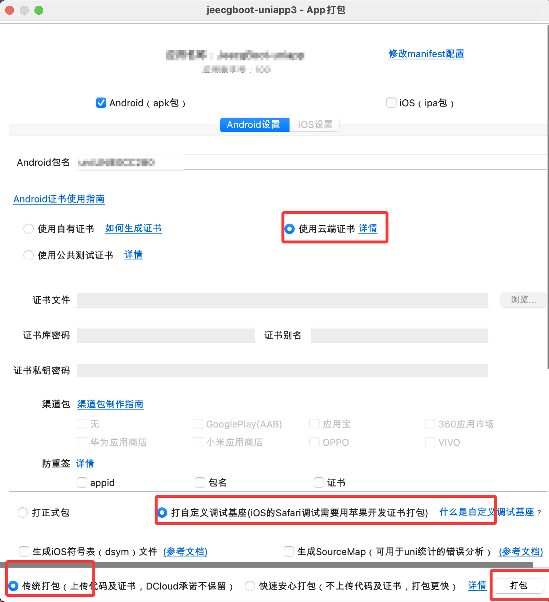
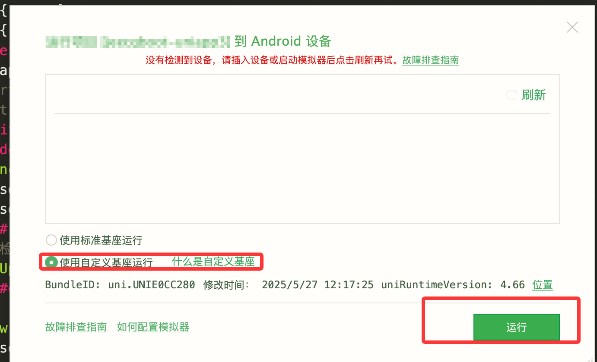

# App 专题

## 1. 其他端正常，`App` 白屏

请检查 `useXxxStore` 的调用，需要在函数内部调用，而不是在函数外部调用。(估计是顶层调用的时候 `pinia` 没有初始化，导致的问题，`app` 端独有的问题。)

```ts
// 错误写法
const userStore = useUserStore()
function foo() {
  userStore.xxx
}
// 正确写法
function foo() {
  const userStore = useUserStore()
  userStore.xxx
}
```

## 2.unibest 的 `App` 模块配置

> 核心解决办法就是把 `manifest.json` 的内容搬运到 `manifest.config.ts` 中。

我们默认的的 `manifest.config.ts` 只包含了比较基础的 `uniapp` 配置，有的时候我们需要在打包 `app` 时在 `hbuilderx` 里面额外设置一些配置，那么就需要配置好后把 `manifest.json` 中的内容拷贝到 `manifest.config.ts` 中，后面运行就不会丢失了。

举例子，我在 `manifest.json` 里面配置了 2个模块配置，如下：


点击左侧下面的 `源码视图` 就可以看到增加了如下内容：


只需要把对应的内容拷贝到 `manifest.config.ts` 中的 `distribute.plugins` 里面即可。

## 3.unibest 的 `原生插件` 模块配置

> [参考文献: 掘金教程 - Unibest 原生插件模块配置](https://juejin.cn/post/7496807547447427081)

## 4. app 热更新

### 4.1 mac 电脑的 ios 模拟器热更新

- `pnpm dev:app`
- 把 `dist/dev/app` 文件夹加入到 `hbx编辑器` 里面，然后运行。这样在编码的时候是可以热更新的。

> 但是上面的方法，在android 模拟器里面不生效。

### 4.2 安卓手机热更新

- 与 `ios` 不同，安卓端需要把整个 `unibest 项目中的 src 文件夹` 加入到 `hbx编辑器` 里面，然后运行。这样在编码的时候也是可以热更新的。
- 真机调试的时候，也是这样。

## 5. 打包原生插件

> 思路：你把整个 `unibest项目的src` 放到 `hbx编辑器`，然后在 `src/mainifest.json` 里面配置好 `原生插件`。然后 `copy` 到`manifest.config.ts`，接着自定义打包基座。注意，全程不需要用到 `pnp build dev:app` 这个命令.

步骤：

- 1. 先配置好 `原生插件`，再 `copy` 到 `manifest.config.ts`。

     

- 2. 先打包自定义基座

     

- 3. 使用自定义基座

     
